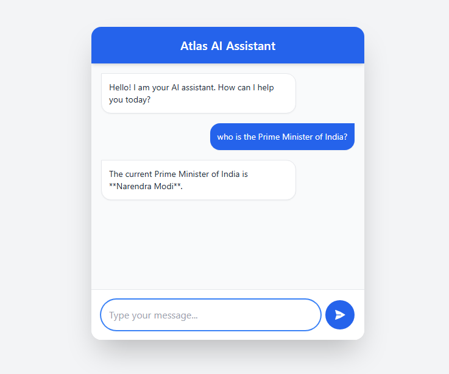

# Atlas AI Chatbot

A beginner-friendly full-stack AI chatbot built with HTML/CSS/Tailwind (Frontend) and Node.js/Express (Backend) using the Google Gemini API.

**Live Link:** [https://atlas-ai-assistant.netlify.app/]

**Screenshot:**


## Project Structure
```text
chatbot/
├── backend/
│   ├── .env              <-- Environment variables (API Key)
│   ├── package.json      <-- Dependencies list
│   └── server.js         <-- Express Server & API logic
└── frontend/
    ├── public/
    │   └── nebula.jpg    <-- Site Favicon
    ├── index.html        <-- Chat UI layout
    ├── script.js         <-- Frontend logic & API calls
    └── style.css         <-- Custom styling
```

## Step-by-Step Local Setup

Follow these steps to run the application locally on your machine.

### Step 1: Set up the Backend
1. Open a terminal (or command prompt) and navigate to the backend folder:
   ```bash
   cd "backend"
   ```
2. Install the necessary dependencies (Express, CORS, Dotenv, and the Google Gen AI SDK):
   ```bash
   npm install
   ```

### Step 2: Configure Environment Variables
1. Inside the `backend` folder, you will see a file named `.env`.
2. Open it and replace the placeholder API key with your actual Gemini API key.
   ```env
   PORT=3000
   GEMINI_API_KEY=your_real_api_key_here
   ```
   *(You can get a free Gemini API key from [Google AI Studio](https://aistudio.google.com/app/apikey))*

### Step 3: Start the Backend Server
1. In the same terminal inside the `backend` folder, run:
   ```bash
   npm start
   ```
2. You should see a message saying: `🚀 Server running on http://localhost:3000`

### Step 4: Open the Frontend
1. Open the `frontend/index.html` file in your web browser.
2. The `script.js` file automatically detects that it is running locally and will connect to your backend at `http://localhost:3000`.

---

## Deployment (Netlify & Render)

This project is configured to be deployed as two separate services: the static frontend on Netlify, and the Node.js backend on Render.

1. **Backend (Render)**: 
   - Connect your GitHub repository to [Render](https://render.com/).
   - Set the Root Directory to `backend`.
   - Add your `GEMINI_API_KEY` as an environment variable.
   - Deploy. Render will automatically run `npm install` and `npm start`.

2. **Frontend (Netlify)**:
   - Copy the live URL from your Render backend.
   - Open `frontend/script.js` and paste it into the `PRODUCTION_API_URL` variable.
   - Push this change to GitHub.
   - Connect your GitHub repository to [Netlify](https://www.netlify.com/) (or drag and drop your project folder).
   - Set the publish directory or base directory to `frontend`.
   - Deploy. Netlify will host your static files automatically.

---

## How It Works (For Beginners)

1. **Frontend (`index.html` & `script.js`)**:
   - The UI is built with basic HTML and styled using **Tailwind CSS** (via CDN for simplicity, so no installation is needed).
   - When you type a message and click send, `script.js` sends it to the backend via `fetch()`. The chat history is ephemeral and starts fresh whenever the page is reloaded.

2. **Backend (`server.js`)**:
   - Built with **Express.js**, it acts as a middleman between your frontend and the Google Gemini API. This keeps your API key securely hidden on the server.
   - It receives your message on the `/api/chat` route, formats your past chat history into the structure Gemini expects, and securely sends it to the **Gemini API** using the latest official SDK (`@google/genai`) and the fast `gemini-2.5-flash` model.
   - Once Gemini responds, the backend sends that text back down to your frontend.
